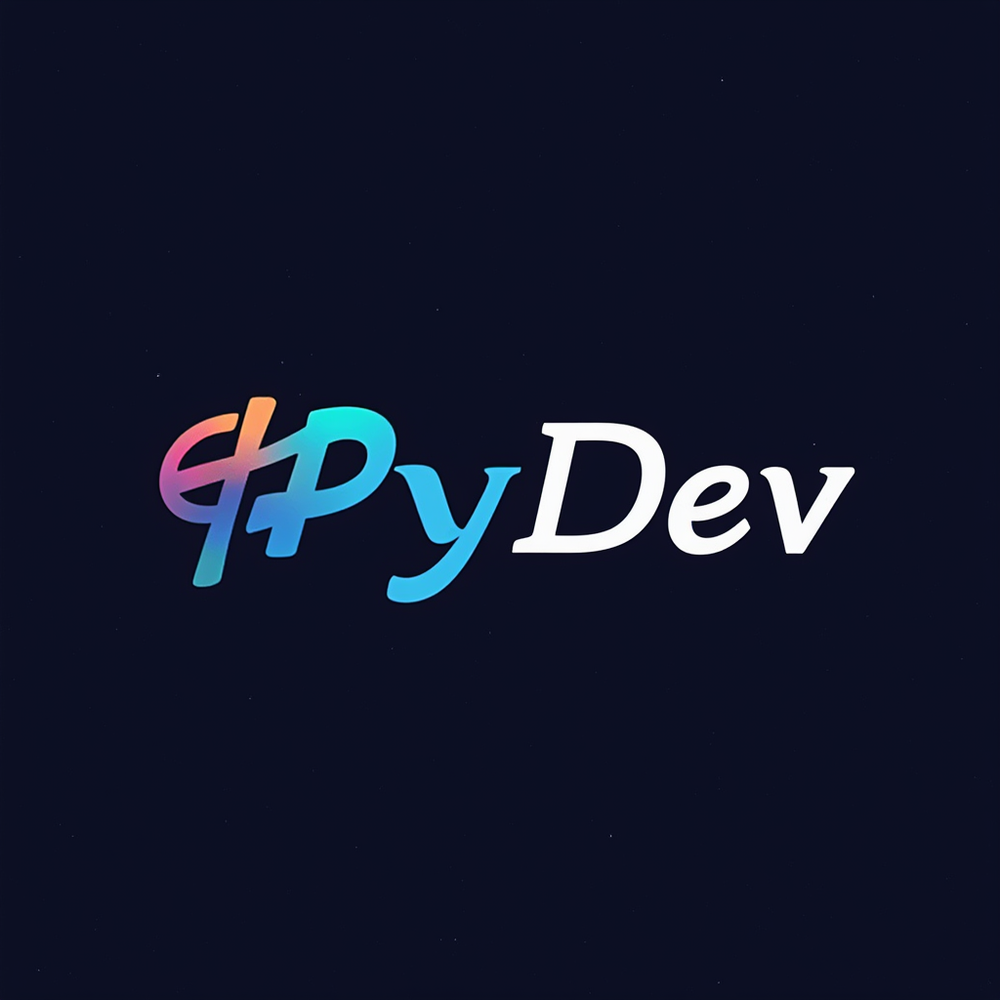
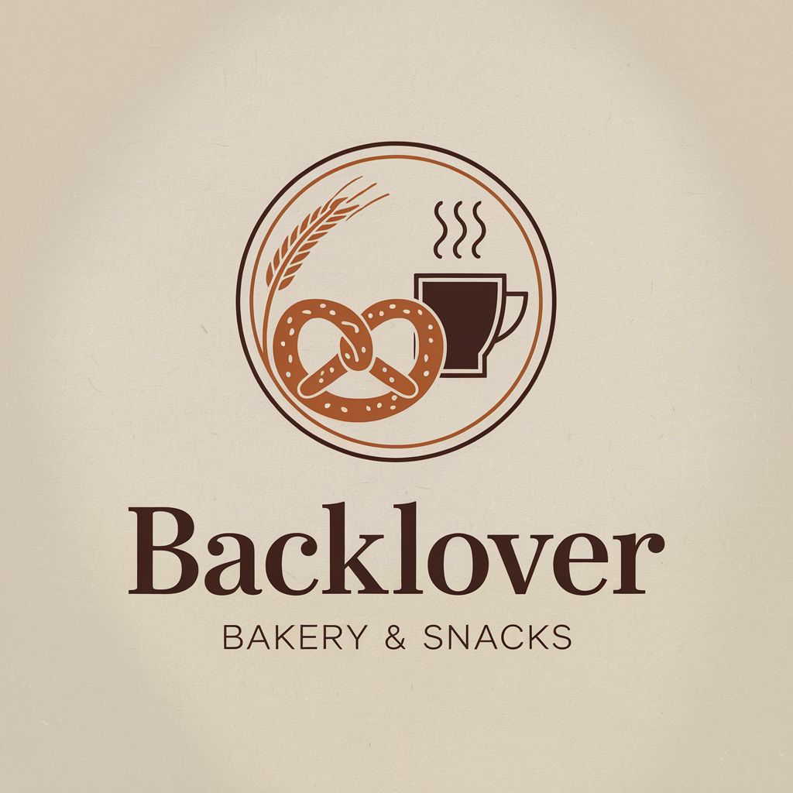
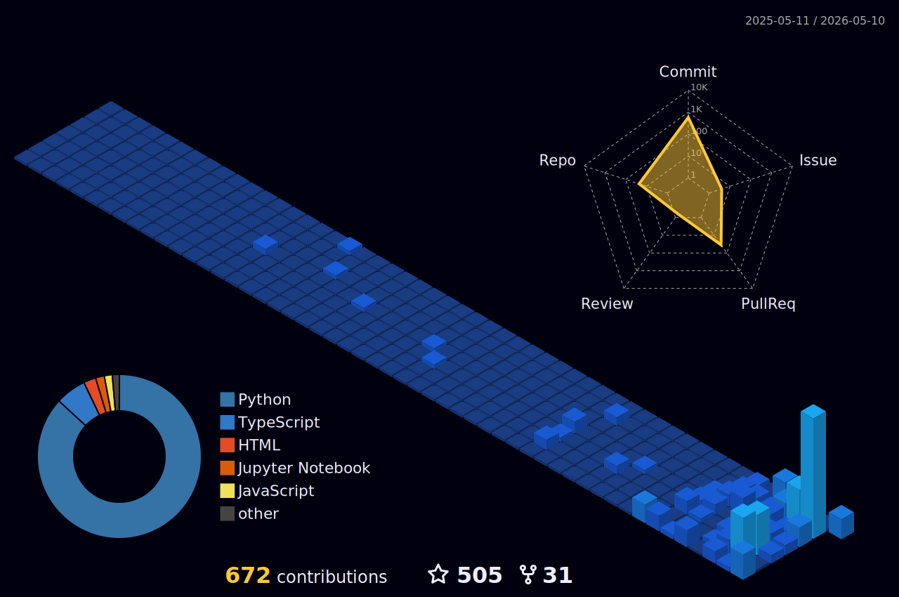
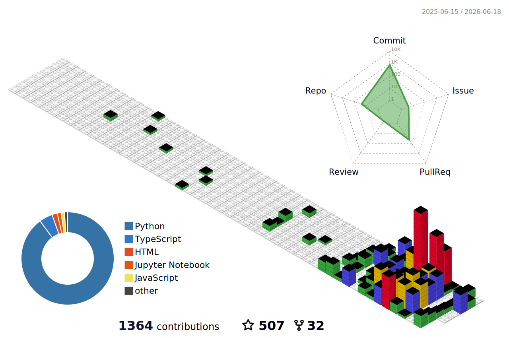
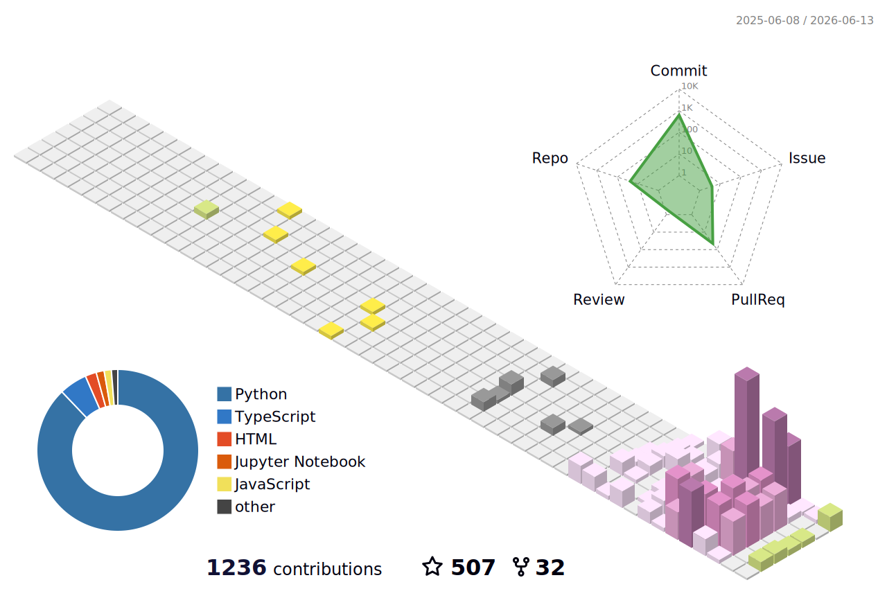
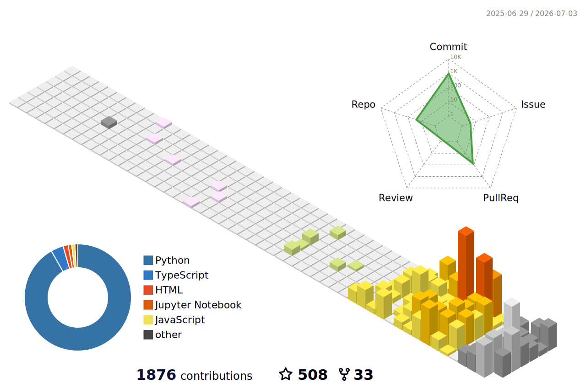

<!-- HEADER -->

  
  

  

<!-- Profile Views and Social Badges -->

  
  
  

<!-- ABOUT ME -->
<h2 id="about" align="center">👋 About Me</h2>

  Full-stack developer based in Germany, focused on Python/Django backends and Vue/Nuxt frontends. 
  I build production systems for small businesses — bakeries, salons, archives etc. — and tinker with developer tooling, CLIs, and template marketplaces on the side. 
  Open to collaboration on Django REST APIs, AI-augmented dev tools, and anything that ships.

  

<!-- TABLE OF CONTENTS -->
<h2 id="toc" align="center">🧭 Table of Contents</h2>

  <a href="#skills">Skills</a> •
  <a href="#focus">Current Focus</a> •
  <a href="#highlights">Yearly Highlights</a> •
  <a href="#stats">GitHub Stats</a> •
  <a href="#activity">Recent Activity</a> •
  <a href="#releases">Latest Releases</a> •
  <a href="#projects">Featured Projects</a> •
  <a href="#pagespeed">PageSpeed</a> •
  <a href="#contributions">Contribution Graph</a> •
  <a href="#connect">Connect</a> •
  <a href="#support">Support</a>

<!-- TECHNICAL EXPERTISE -->

  
  
  

<h2 id="skills" align="center">💻 Technical Expertise</h2>

<table width="100%">
  <tr>
    <td width="50%" valign="top">
      <h3 align="center">Core Technologies</h3>
      
   

      <h4>🔹 Frontend Development</h4>
      
Proficient in Vue.js, JavaScript, HTML, and CSS. I build interactive, accessible interfaces.

      

        
        
        
        
        
        
      

      <h4>🔹 Backend Mastery</h4>
      
Django, Django REST Framework, Flask, FastAPI — robust, well-tested server-side systems.

      

        
        
        
        
      

      <h4>🔹 Databases</h4>
      
PostgreSQL, MySQL, Redis — modeling, indexing, and caching for performance at scale.

      

        
        
        
        
      

    </td>
    <td width="50%" valign="top">
      <h3 align="center">Tooling & Infra</h3>
      

        
      

      <h4>🔹 Cloud & Deployment</h4>
      
Shipping on AWS, Heroku, Render, and Docker — with CI/CD pipelines that don't break on Friday.

      

        
        
        
        
      

      <h4>🔹 APIs & Security</h4>
      
REST, JWT auth, Swagger/OpenAPI specs, Postman collections — clean contracts for clean systems.

      

        
        
        
        
      

      <h4>🔹 Dev Environment</h4>
      
Git, GitHub, VS Code, PyCharm — plus a healthy collection of editor plugins and CLI tools.

      

        
        
        
        
      

    </td>
  </tr>
</table>

<b>More Skills</b> — paradigms, OS, async, data, services

 

<table width="100%">
  <tr>
    <td valign="top" width="33%">
      <h4>🧠 Paradigms</h4>
      

        
        
        
      

    </td>
    <td valign="top" width="33%">
      <h4>🖥️ Operating Systems</h4>
      

        
        
        
      

    </td>
    <td valign="top" width="33%">
      <h4>🔄 Async</h4>
      

        
        
        
      

    </td>
  </tr>
  <tr>
    <td valign="top">
      <h4>🧩 Frontend Frameworks</h4>
      

        
        
        
      

    </td>
    <td valign="top">
      <h4>📊 Data Science</h4>
      

        
        
        
        
      

    </td>
    <td valign="top">
      <h4>🔧 IDEs / Notebooks</h4>
      

        
        
        
      

    </td>
  </tr>
</table>

<!-- CURRENT FOCUS -->

  
  
  

<h2 id="focus" align="center">🎯 Current Focus</h2>

<table>
  <tr>
    <td align="center" width="33%">
      
      
Building scalable REST APIs with Django

    </td>
    <td align="center" width="33%">
      
      
Exploring Vue.js 3 Composition API

    </td>
    <td align="center" width="33%">
      
      
Improving deployment workflows with Docker

    </td>
  </tr>
  <tr>
    <td align="center">
      
      
Integrating AI capabilities into Django/Vue applications

    </td>
    <td align="center" colspan="2">
      
      
<b>PyDev: Python Development Platform</b> — enterprise-grade tooling that combines a CLI, a secure template marketplace, and AI-driven dev features.

    </td>
  </tr>
  <tr>
    <td align="center">
      
      
<b>Baeckrei</b> — full-featured bakery management system: inventory, recipes, online orders, customer accounts, real-time production scheduling.

    </td>
    <td align="center" colspan="2">
      
<b>Media Archive</b> — digital archive for magazines and news with edition management, metadata tracking, multi-format preservation, and searchable taxonomies.

    </td>
  </tr>
</table>

<!-- YEARLY HIGHLIGHTS -->

  
  
  

<h2 id="highlights" align="center">🚀 Yearly Highlights</h2>

<h3 align="center">📍 2026 — Current Year</h3>

<!-- HIGHLIGHTS_CURRENT_YEAR:START -->
- Shifting focus toward developer tooling and automation — building things that help engineers, not just end users.
- Branching out from web into desktop and CLI applications.
- Investing in public presence: portfolio, blog, and open-source contributions.
<!-- HIGHLIGHTS_CURRENT_YEAR:END -->

<b>📊 This year, by the numbers</b>

<!-- HIGHLIGHTS_STATS:START -->

   

<!-- HIGHLIGHTS_STATS:END -->

<h3 align="center">🗓️ 2025</h3>

- Maintained and grew long-running client systems through their first full year in production.
- Went hands-on with the modern AI/LLM stack — local models, RAG, and agent workflows.
- Contributed to community and educational projects beyond my own repos.

<h3 align="center">🗓️ 2024</h3>

- A year of shipping — a wave of full-stack Django and Vue projects went live for real users.
- Established long-running client engagements that are still running today.
- Earned community recognition through open-source work and collaborative tooling.

<!-- GITHUB STATS -->

  
  
  

<h2 id="stats" align="center">📊 GitHub Stats</h2>

  

  

  
  

  

  

<!-- RECENT ACTIVITY -->

  
  
  

<h2 id="activity" align="center">⚡ Recent Activity</h2>

<!-- ACTIVITY:START -->
- 🔀 Opened PR [#1](https://github.com/bloghd/bloghd/pull/1) in [`bloghd/bloghd`](https://github.com/bloghd/bloghd)
- 🍴 Forked [`bloghd/bloghd`](https://github.com/bloghd/bloghd)
- 🍴 Forked [`primer/css`](https://github.com/primer/css)
- 🍴 Forked [`github/spec-kit`](https://github.com/github/spec-kit)
- 🍴 Forked [`refactoringhq/tolaria`](https://github.com/refactoringhq/tolaria)
- ❗ Opened issue [#20](https://github.com/AbdullahBakir97/Stock-Manager/issues/20) in [`AbdullahBakir97/Stock-Manager`](https://github.com/AbdullahBakir97/Stock-Manager)
- 🔀 Opened PR [#19](https://github.com/AbdullahBakir97/Stock-Manager/pull/19) in [`AbdullahBakir97/Stock-Manager`](https://github.com/AbdullahBakir97/Stock-Manager)
- 🔀 Closed PR [#18](https://github.com/AbdullahBakir97/Stock-Manager/pull/18) in [`AbdullahBakir97/Stock-Manager`](https://github.com/AbdullahBakir97/Stock-Manager)
<!-- ACTIVITY:END -->

<!-- LATEST RELEASES -->

  
  
  

<h2 id="releases" align="center">📦 Latest Releases</h2>

<!-- LATEST_RELEASES:START -->
- 📦 [`Stock-Manager` `v2.4.3`](https://github.com/AbdullahBakir97/Stock-Manager/releases/tag/v2.4.3) — Stock Manager Pro v2.4.3 (2026-04-23)
<!-- LATEST_RELEASES:END -->

<!-- FEATURED PROJECTS -->

  
  
  

<h2 id="projects" align="center">🏗️ Featured Projects</h2>

  
  

  
  

  
  

  
  

<b>More projects</b> — Django blog, BookStore, JS to-do, automation, landing pages

 

  
  

  
  

  
  

<!-- GOOGLE PAGESPEED -->

  
  
  

<h2 id="pagespeed" align="center">⚡ Google PageSpeed</h2>

Live performance metrics for <a href="http://kharsa-style.de/">Kharsa Style</a> — fetched daily from the PageSpeed Insights API.

<!-- PAGESPEED:START -->
<!-- Auto-updated daily. -->

<i>PageSpeed scores will appear here after the first run of the readme workflow.</i>

<!-- PAGESPEED:END -->

<small>This section is not affiliated with Google. PageSpeed Insights is a trademark of Google LLC.</small>

<!-- CONTRIBUTION GRAPH -->

  
  
  

<h2 id="contributions" align="center">🐍 Contribution Graph</h2>

  <picture>
    <source media="(prefers-color-scheme: dark)" srcset="https://raw.githubusercontent.com/AbdullahBakir97/AbdullahBakir97/output/github-contribution-grid-snake-dark.svg">
    <source media="(prefers-color-scheme: light)" srcset="https://raw.githubusercontent.com/AbdullahBakir97/AbdullahBakir97/output/github-contribution-grid-snake.svg">
    
  </picture>

<h3 align="center">🎨 3D Animated Profile</h3>

  

<b>More 3D styles</b> — night-view, gitblock, season-animate, south-season

 

  

  

  

  

<h3 align="center">🌆 GitHub Skylines</h3>

<!-- SKYLINE_GRID:START -->
<table align="center" width="100%"><tr><td width="33%" align="center">
<b>2024</b>
</td><td width="33%" align="center">
<b>2025</b>
</td><td width="33%" align="center">
<b>2026 (live)</b>
</td></tr></table>
<!-- SKYLINE_GRID:END -->

<!-- STL_LINKS:START -->

<b>📐 Spin a 3D model:</b> <a href="https://github.com/AbdullahBakir97/AbdullahBakir97/blob/metrics-output/skyline-2024.stl">2024 STL</a> · <a href="https://github.com/AbdullahBakir97/AbdullahBakir97/blob/metrics-output/skyline-2025.stl">2025 STL</a> · <a href="https://github.com/AbdullahBakir97/AbdullahBakir97/blob/metrics-output/skyline-2026.stl">2026 STL (live)</a>

<!-- STL_LINKS:END -->

<h3 align="center">🏙️ GitHub Cities</h3>

<!-- CITY_GRID:START -->
<table align="center" width="100%"><tr><td width="33%" align="center">
<b>2024</b>
</td><td width="33%" align="center">
<b>2025</b>
</td><td width="33%" align="center">
<b>2026 (live)</b>
</td></tr></table>
<!-- CITY_GRID:END -->

<!-- GITCITY_LINKS:START -->

<b>🚗 Drive through:</b> <a href="https://honzaap.github.io/GithubCity?name=AbdullahBakir97&year=2024">2024 city</a> · <a href="https://honzaap.github.io/GithubCity?name=AbdullahBakir97&year=2025">2025 city</a> · <a href="https://honzaap.github.io/GithubCity?name=AbdullahBakir97&year=2026">2026 city (live)</a>

<!-- GITCITY_LINKS:END -->

<em>⚠️ Regenerated daily. The current year refreshes with new contributions; past years are frozen archives. Click any tile or link for the interactive view — STLs render in GitHub's built-in 3D viewer, cities open at <a href="https://honzaap.github.io/GithubCity">honzaap.github.io/GithubCity</a>.</em>

<!-- CONNECT WITH ME -->

  
  
  

<h2 id="connect" align="center">🌍 Connect With Me</h2>

  
  
  
  

  📧 <a href="mailto:abdullah.bakir.1997@gmail.com">abdullah.bakir.1997@gmail.com</a>

<!-- SUPPORT -->

  
  
  

<h2 id="support" align="center">☕ Support My Work</h2>

If you find my projects helpful or want to support my work:

  

<em>Your support helps me create more open-source projects and tutorials!</em>

