<!-- ============================================================ -->
<!-- 🎬 ANIMATED HEADER BANNER — capsule-render with wave gradient -->
<!-- ============================================================ -->
<a href="https://github.com/AbdullahBakir97">
  
</a>

<!-- 🐙 PROFESSIONAL GITHUB IDENTIFIER — pulsing brand-red halo + Invertocat -->
<p align="center">
  <a href="https://github.com/AbdullahBakir97" aria-label="GitHub profile">
    
  </a>
</p>

<p align="center">
  <a href="https://github.com/AbdullahBakir97">
    
  </a>
</p>

<!-- 🪄 TYPING SVG — 11 rotating headlines, JetBrains Mono coding font -->
<div align="center">
  <a href="https://github.com/AbdullahBakir97">
    
  </a>
</div>

<!-- 🏷️ PROFESSIONAL BADGES — stats row -->
<p align="center">
  <a href="https://github.com/AbdullahBakir97"></a>
  <a href="https://github.com/AbdullahBakir97?tab=followers"></a>
  <a href="https://github.com/AbdullahBakir97"></a>
  <a href="https://codetime.dev"></a>
</p>

<!-- 🏷️ PROFESSIONAL BADGES — contact / availability row -->
<p align="center">
  <a href="mailto:abdullah.bakir.1997@gmail.com"></a>
  <a href="https://www.linkedin.com/in/abdullah-bakir-809065273/"></a>
  <a href="https://t.me/BlackSea0011"></a>
  <a href="https://github.com/AbdullahBakir97"></a>
</p>

<div align="center">
  
</div>

<!-- ============================================================ -->
<!-- 💻 ABOUT ME — animated cinematic hero card                    -->
<!-- ============================================================ -->
<h2 id="about" align="center">💻 About Me</h2>

<p align="center">
  <a href="https://github.com/AbdullahBakir97">
    
  </a>
</p>

<details>
<summary align="center"><b>📋 The full bio block</b> — pronouns, frameworks, databases, languages I speak, what I'm into</summary>

<br/>

```python
class AbdullahBakir:
    """Full-stack developer crafting production-grade web systems."""

    pronouns        = "he/him"
    location        = "🇩🇪 Germany — open to remote"
    languages       = ["Python", "TypeScript", "JavaScript"]
    frameworks      = ["Django", "Django REST", "Vue 3", "Nuxt"]
    databases       = ["PostgreSQL", "MySQL", "Redis"]
    currently_into  = ["AI-augmented dev tooling", "GitHub Apps", "CLI ergonomics"]
    available_for   = ["Open source", "Freelance", "Long-term collaboration"]
    speaks          = ["English", "Deutsch", "العربية"]

    def philosophy(self) -> str:
        return "Ship something useful → learn → ship again."


me = AbdullahBakir()
print(me.philosophy())  # → Ship something useful → learn → ship again.
```

</details>

<!-- 💬 single rotating motto line — color changes per text shown -->
<div align="center">
  
</div>

<!-- 💭 QUOTE OF THE DAY — auto-rotates daily by day-of-year -->
<!-- QUOTE:START -->
<p align="center">
  <i>"First, solve the problem. Then, write the code."</i><br/>
  <sub>— <b>John Johnson</b></sub>
</p>
<!-- QUOTE:END -->

<div align="center">
  
</div>

<!-- TABLE OF CONTENTS -->
<h2 id="toc" align="center">🧭 Table of Contents</h2>

<p align="center">
  <a href="#skills">Skills</a> •
  <a href="#focus">Current Focus</a> •
  <a href="#highlights">Yearly Highlights</a> •
  <a href="#stats">GitHub Stats</a> •
  <a href="#activity">Recent Activity</a> •
  <a href="#releases">Latest Releases</a> •
  <a href="#projects">Featured Projects</a> •
  <a href="#pagespeed">PageSpeed</a> •
  <a href="#contributions">Contribution Graph</a> •
  <a href="#connect">Connect</a> •
  <a href="#support">Support</a>
</p>

<!-- TECHNICAL EXPERTISE -->
<div align="center">
  
  <a href="https://github.com/AbdullahBakir97">
    
  </a>
  
</div>

<h2 id="skills" align="center">💻 Tech Stack</h2>

<p align="center">
  <i>Production-grade tools for production-grade systems.</i>
</p>

<!-- 🌟 Hero icon row — full stack at a glance -->
<p align="center">
  <a href="https://github.com/AbdullahBakir97">
    
  </a>
</p>

<br/>

<!-- 💎 Elite tech stack cards — single SVG, 6 glassmorphism cards in 3×2 grid
     with accent stripes, stats, and animated proficiency bars (Vercel/Linear aesthetic) -->
<a href="https://github.com/AbdullahBakir97?tab=repositories">
  
</a>

<br/><br/>

<!-- 🧠 NEURAL SKILL ATLAS
     ──────────────────────────────────────────────────────────────────────
     The brain SVG below is built from Wikimedia Commons' anatomically-
     accurate "Human-brain.SVG" by Hugh Guiney (CC-BY-SA-3.0), recolored
     with our neon palette via scripts/build_anatomical_brain.py.

     Regenerate (e.g., to tweak colors) with:
        python scripts/build_anatomical_brain.py
     ────────────────────────────────────────────────────────────────────── -->

<h3 align="center">🧠 Neural Skill Atlas</h3>

<p align="center">
  <sub><i>A living anatomical map of how my technical mind is organized — 200+ paths of real neuroanatomy, recolored with a neon palette and animated to pulse like a living brain.</i></sub>
</p>

<p align="center">
  
</p>

<p align="center">
  <a href="https://abdullahbakir97.github.io/AbdullahBakir97/"></a>
  &nbsp;
  <a href="https://commons.wikimedia.org/wiki/File:Human-brain.SVG"></a>
</p>

<p align="center"><sub><i>🖱️ The interactive 3D version (above) extrudes every anatomical path into a 3D mesh with neon emissive shaders. Drag to rotate, scroll to zoom, right-drag to pan, auto-rotates when idle.</i></sub></p>

<details>
<summary align="center"><b>📦 More skills</b> — Paradigms · Operating Systems · Async · UI frameworks · Data Science · IDEs · APIs &amp; Security</summary>

<br/>

<table align="center" width="100%">
<tr>
<td align="center" width="33%" valign="top"><h4>🧠 Paradigms &amp; Architecture</h4><p>     </p></td>
<td align="center" width="33%" valign="top"><h4>🖥️ Operating Systems</h4><p>  </p></td>
<td align="center" width="33%" valign="top"><h4>🔄 Async &amp; Messaging</h4><p>   </p></td>
</tr>
<tr>
<td align="center" width="33%" valign="top"><h4>🧩 UI Frameworks</h4><p>   </p></td>
<td align="center" width="33%" valign="top"><h4>📊 Data Science</h4><p>    </p></td>
<td align="center" width="33%" valign="top"><h4>🔧 IDEs &amp; Notebooks</h4><p>   </p></td>
</tr>
<tr>
<td align="center" width="33%" valign="top"><h4>🔐 APIs &amp; Security</h4><p>   </p></td>
<td align="center" width="33%" valign="top"><h4>🎨 Design &amp; Docs</h4><p>  </p></td>
<td align="center" width="33%" valign="top"><h4>🌐 Languages</h4><p>  </p></td>
</tr>
</table>

</details>

<!-- CURRENT FOCUS -->
<div align="center">
  
  <a href="https://github.com/AbdullahBakir97">
    
  </a>
  
</div>

<h2 id="focus" align="center">🎯 Current Focus</h2>

<p align="center">
  
</p>

<!-- YEARLY HIGHLIGHTS -->
<div align="center">
  
  <a href="https://github.com/AbdullahBakir97">
    
  </a>
  
</div>

<h2 id="highlights" align="center">🚀 Yearly Highlights</h2>

<p align="center">
  
</p>

<!-- 📊 Live stats — auto-refreshed daily from GitHub GraphQL by readme.yml -->
<p align="center"><b>📊 This year, live from GitHub</b></p>

<!-- HIGHLIGHTS_STATS:START -->
<p align="center">   </p>
<!-- HIGHLIGHTS_STATS:END -->

<!-- The narrative bullets are still updated separately by you — kept as a marker
     so the text stays editable without rebuilding the SVG. -->
<!-- HIGHLIGHTS_CURRENT_YEAR:START -->
<!-- (Narrative for the current year is rendered inside yearly-highlights.svg) -->
<!-- HIGHLIGHTS_CURRENT_YEAR:END -->

<!-- GITHUB STATS -->
<div align="center">
  
  <a href="https://github.com/AbdullahBakir97">
    
  </a>
  
</div>

<h2 id="stats" align="center">📊 GitHub Stats</h2>

<div align="center">
  <a href="https://github.com/AbdullahBakir97">
    
  </a>
</div>

<div align="center">
  <a href="https://github.com/AbdullahBakir97">
    
    
    
  </a>
</div>

<div align="center">
  
  
</div>

<div align="center">
  <a href="https://github.com/AbdullahBakir97">
    
  </a>
</div>

<div align="center">
  <a href="https://github.com/AbdullahBakir97">
    
  </a>
</div>

<!-- ⏱️ WAKATIME WEEKLY STATS — auto-updated by .github/workflows/waka-stats.yml -->
<h3 align="center">⏱️ Weekly Coding Time</h3>

<!--START_OF_CODE_STATS-->
<p align="center"><i>WakaTime weekly stats appear here after the first run of the waka-stats workflow.<br/>Set <code>WAKATIME_API_KEY</code> in repo secrets, then trigger the "WakaTime Weekly Stats" workflow.</i></p>
<!--END_OF_CODE_STATS-->

<!-- RECENT ACTIVITY -->
<div align="center">
  
  <a href="https://github.com/AbdullahBakir97">
    
  </a>
  
</div>

<h2 id="activity" align="center">⚡ Recent Activity</h2>

<!-- 🌳 GITGRAPH — Mermaid visualization of recent push events per repo -->
<h3 align="center">🌳 Branch Flow (last 7 days)</h3>

<!-- GITGRAPH:START -->
_No recent push events to visualize._
<!-- GITGRAPH:END -->

<h3 align="center">📜 Event Log</h3>

<!-- ACTIVITY:START -->
_No recent public activity._
<!-- ACTIVITY:END -->

<!-- LATEST RELEASES -->
<div align="center">
  
  <a href="https://github.com/AbdullahBakir97">
    
  </a>
  
</div>

<h2 id="releases" align="center">📦 Latest Releases</h2>

<!-- LATEST_RELEASES:START -->
- 📦 [`Stock-Manager` `v2.5.1`](https://github.com/AbdullahBakir97/Stock-Manager/releases/tag/v2.5.1) — Stock Manager Pro v2.5.1 <sub>(2026-05-02)</sub>
- 📦 [`PortfolioCraft` `v0.4.4`](https://github.com/AbdullahBakir97/PortfolioCraft/releases/tag/v0.4.4) — v0.4.4 — Complete enum-leak sweep <sub>(2026-05-01)</sub>
- 📦 [`cortex` `v1.0.0`](https://github.com/AbdullahBakir97/cortex/releases/tag/v1.0.0) — v1.0.0 — first GA release <sub>(2026-04-27)</sub>
<!-- LATEST_RELEASES:END -->

<!-- FEATURED PROJECTS -->
<div align="center">
  
  <a href="https://github.com/AbdullahBakir97">
    
  </a>
  
</div>

<h2 id="projects" align="center">🏗️ Featured Projects</h2>

<!-- ============================================================ -->
<!-- 🔥 AUTO-RANKED FEATURED PROJECTS — refreshed weekly by readme.yml -->
<!-- ============================================================ -->
<!-- FEATURED_PROJECTS:START -->
<p align="center"><sub>📊 Auto-ranked weekly by recent commits + stars. Last updated 2026-05-04.</sub></p>

<table align="center" width="100%"><tr><td valign="top" width="50%"><h3>🧠 AI / Data · <a href="https://github.com/AbdullahBakir97/cortex">cortex</a></h3><p>Memory-augmented agent kernel — context windows, retrieval, and structured output for LLM workflows.</p><p>    </p></td><td valign="top" width="50%"><h3>🌐 Backend / API · <a href="https://github.com/AbdullahBakir97/Stock-Manager">Stock-Manager</a></h3><p>Professional desktop inventory management for Windows — local-first SQLite store, barcode-aware, multi-user with role separation.</p><p>    </p></td></tr><tr><td valign="top" width="50%"><h3>🌐 Backend / API · <a href="https://github.com/AbdullahBakir97/Barber-Salon">Barber-Salon</a></h3><p>Salon management platform — appointments, staff profiles, customer reviews, gallery, products, multi-language. Django + DRF + Vue.</p><p>    </p></td><td valign="top" width="50%"><h3>🛠️ Tooling · <a href="https://github.com/AbdullahBakir97/PortfolioCraft">PortfolioCraft</a></h3><p>Generate a verifiable professional portfolio from your GitHub history — README block, JSON Resume, PDF CV, and stat cards. GitHub Action + CLI.</p><p>    </p></td></tr><tr><td valign="top" width="50%"><h3>🌐 Backend / API · <a href="https://github.com/AbdullahBakir97/Jobs-Portal">Jobs-Portal</a></h3><p>Jobs portal for seekers and employers — listings, applications, employer dashboards, REST API. Django + DRF.</p><p>    </p></td><td valign="top" width="50%"><h3>🌐 Backend / API · <a href="https://github.com/AbdullahBakir97/Django-Store">Django-Store</a></h3><p>Amazon-style e-commerce platform — products, brands, reviews, orders, payments, charts, multi-language. Django + DRF + Bootstrap.</p><p>    </p></td></tr></table>
<!-- FEATURED_PROJECTS:END -->

<br/>

<details>
<summary align="center"><b>📖 Hand-written narrative cards</b> — Problem · Approach · Stack · Outcome</summary>

<br/>

<!-- ============================================================ -->
<!-- 🌟 NARRATIVE CARDS — Problem · Approach · Stack · Outcome     -->
<!-- ============================================================ -->

<table width="100%">
  <tr>
    <td valign="top" width="50%">
      <h3>🥖 Baeckrei — Bakery Management</h3>
      <p>
        <b>Problem.</b> Small bakeries juggle inventory, recipes, and customer orders on paper or fragmented tools.<br/>
        <b>Approach.</b> One Django/Vue app: real-time production scheduling, recipe-driven inventory deduction, customer accounts, online orders.<br/>
        <b>Stack.</b> <code>Django · DRF · Vue 3 · PostgreSQL · Redis · Docker</code><br/>
        <b>Outcome.</b> Live with one bakery; expanding to two more in 2026.
      </p>
      <p><a href="https://github.com/AbdullahBakir97/Baeckrei"></a></p>
    </td>
    <td valign="top" width="50%">
      <h3>📦 Stock-Manager — Desktop Inventory</h3>
      <p>
        <b>Problem.</b> Browser-based inventory tools force constant network round-trips for shop-floor users.<br/>
        <b>Approach.</b> Native Python desktop app — local-first inventory with sync; barcode-aware; multi-user with role separation.<br/>
        <b>Stack.</b> <code>Python · Tkinter/PyQt · SQLite · Sync layer</code><br/>
        <b>Outcome.</b> v2.4.3 shipped; daily-driver for the inventory clerk role.
      </p>
      <p><a href="https://github.com/AbdullahBakir97/Stock-Manager"></a></p>
    </td>
  </tr>
  <tr>
    <td valign="top" colspan="2">
      <h3>🛠️ PyDev — Python Development Platform</h3>
      <p>
        <b>Problem.</b> Python dev tooling is fragmented — CLI scaffolds, template marketplaces, and AI assistants live in separate worlds.<br/>
        <b>Approach.</b> One enterprise-grade platform combining a CLI, a secure template marketplace, and AI-driven dev features (issue triage, PR coaching, conventional commits, README generation, AI-quality gating).<br/>
        <b>Stack.</b> <code>Python · GitHub Apps API · LLM tooling · CLI ergonomics</code><br/>
        <b>Outcome.</b> 5 supporting GitHub Apps shipped April 2026 — issue-triage-bot, pr-coach, commit-craft, repodoc-ai, ai-quality-gate.
      </p>
      <p><a href="https://github.com/AbdullahBakir97?tab=repositories&q=pr-coach+OR+commit-craft+OR+repodoc-ai+OR+ai-quality-gate+OR+issue-triage-bot"></a></p>
    </td>
  </tr>
</table>

</details>

<!-- 🎬 TERMINAL DEMO — record once with `vhs` or asciinema and drop the GIF/SVG below -->
<details>
<summary align="center"><b>🎥 Watch a CLI demo</b> — record with <code>vhs</code> or <code>asciinema</code> (instructions below)</summary>

<br/>

<p align="center">
  
  <br/>
  <i>Place your recorded demo at <code>assets/cli-demo.gif</code>.</i>
</p>

<br/>

<details>
<summary><b>How to record (5 minutes)</b></summary>

**Option A — `vhs` (Charm) — produces clean GIF/MP4:**
```bash
brew install vhs                    # macOS
# or: go install github.com/charmbracelet/vhs@latest

# Create assets/demo.tape:
cat > assets/demo.tape <<'EOF'
Output assets/cli-demo.gif
Set FontSize 16
Set Width 1200
Set Height 600
Type "stock-manager --help"
Enter
Sleep 2s
Type "stock-manager list --low-stock"
Enter
Sleep 3s
EOF

vhs assets/demo.tape
git add assets/cli-demo.gif && git commit -m "demo: stock-manager CLI" && git push
```

**Option B — `asciinema` — embeds a playable terminal recording:**
```bash
asciinema rec demo.cast
# do your thing in the terminal, exit when done
asciinema upload demo.cast    # gives you a public URL
```
Then replace the `` above with `<a href="...asciinema URL..."></a>`.

</details>

</details>

<br/>

<h3 align="center">📌 Pinned Repositories</h3>

<p align="center"><sub>🔄 Auto-refreshed daily from GitHub's pinned-repos GraphQL API. Tracks new pins automatically.</sub></p>

<!-- PINNED_REPOS:START -->
<table align="center" width="100%"><tr><td valign="top" width="50%" style="padding:8px"><a href="https://github.com/AbdullahBakir97/Stock-Manager"><h3>📌 Stock-Manager</h3></a><p>Professional desktop inventory management for Windows — local-first SQLite store, barcode-aware, multi-user with role separation.</p><p>   <sub>last commit · 2026-05-02</sub></p><p><code>desktop-app</code> <code>inventory-management</code> <code>offline</code> <code>pyqt6</code></p></td><td valign="top" width="50%" style="padding:8px"><a href="https://github.com/AbdullahBakir97/Django-Store"><h3>📌 Django-Store</h3></a><p>Amazon-style e-commerce platform — products, brands, reviews, orders, payments, charts, multi-language. Django + DRF + Bootstrap.</p><p>   <sub>last commit · 2026-05-04</sub></p><p><code>ajax</code> <code>bootstrap</code> <code>cashing</code> <code>celery</code></p></td></tr><tr><td valign="top" width="50%" style="padding:8px"><a href="https://github.com/AbdullahBakir97/Barber-Salon"><h3>📌 Barber-Salon</h3></a><p>Salon management platform — appointments, staff profiles, customer reviews, gallery, products, multi-language. Django + DRF + Vue.</p><p>   <sub>last commit · 2026-05-04</sub></p><p><code>css</code> <code>django</code> <code>html5</code> <code>javascript</code></p></td><td valign="top" width="50%" style="padding:8px"><a href="https://github.com/AbdullahBakir97/Jobs-Portal"><h3>📌 Jobs-Portal</h3></a><p>Jobs portal for seekers and employers — listings, applications, employer dashboards, REST API. Django + DRF.</p><p>   <sub>last commit · 2026-05-04</sub></p><p><code>css</code> <code>django</code> <code>html</code> <code>javascript</code></p></td></tr><tr><td valign="top" width="50%" style="padding:8px"><a href="https://github.com/AbdullahBakir97/Django--LMS--Learning-Management-System"><h3>📌 Django--LMS--Learning-Management-System</h3></a><p>Learning management system — courses, certifications, messaging, networking, groups. Django + Channels.</p><p>   <sub>last commit · 2026-05-04</sub></p><p><code>certifications</code> <code>collaboration</code> <code>companies</code> <code>connections</code></p></td><td valign="top" width="50%" style="padding:8px"><a href="https://github.com/AbdullahBakir97/PortfolioCraft"><h3>📌 PortfolioCraft</h3></a><p>Generate a verifiable professional portfolio from your GitHub history — README block, JSON Resume, PDF CV, and stat cards. GitHub Action + CLI.</p><p>   <sub>last commit · 2026-05-01</sub></p><p><code>automation</code> <code>cli</code> <code>cv-generator</code> <code>developer-portfolio</code></p></td></tr></table>
<!-- PINNED_REPOS:END -->

<details>
<summary align="center"><b>More projects</b> — Django blog, BookStore, JS to-do, automation, landing pages</summary>

<br/>

<div align="center">
  <a href="https://github.com/AbdullahBakir97/Django-Blog-app">
    
  </a>
  <a href="https://github.com/AbdullahBakir97/BookStore">
    
  </a>
</div>

<div align="center">
  <a href="https://github.com/AbdullahBakir97/Automtion">
    
  </a>
  <a href="https://github.com/AbdullahBakir97/2050-Bootstrap-Landing-page">
    
  </a>
</div>

<div align="center">
  <a href="https://github.com/AbdullahBakir97/JS-TO-DO">
    
  </a>
  <a href="https://github.com/AbdullahBakir97/AbdullahBakir97">
    
  </a>
</div>

</details>

<!-- GOOGLE PAGESPEED -->
<div align="center">
  
  <a href="https://github.com/AbdullahBakir97">
    
  </a>
  
</div>

<h2 id="pagespeed" align="center">⚡ Google PageSpeed</h2>

<p align="center">Live performance metrics for <a href="http://kharsa-style.de/">Kharsa Style</a> — fetched daily from the PageSpeed Insights API.</p>

<!-- PAGESPEED:START -->
<!-- Auto-updated daily. -->
<p align="center"><i>PageSpeed scores will appear here after the first run of the readme workflow.</i></p>
<!-- PAGESPEED:END -->

<p align="center"><small>This section is not affiliated with Google. PageSpeed Insights is a trademark of Google LLC.</small></p>

<!-- CONTRIBUTION GRAPH -->
<div align="center">
  
  <a href="https://github.com/AbdullahBakir97">
    
  </a>
  
</div>

<h2 id="contributions" align="center">🐍 Contribution Graph</h2>

<!-- SNAKE_GRID:START -->
<table align="center" width="100%"><tr><td colspan="3" align="center"><picture><source media="(prefers-color-scheme: dark)" srcset="https://raw.githubusercontent.com/AbdullahBakir97/AbdullahBakir97/output/github-contribution-grid-snake-dark.svg"><source media="(prefers-color-scheme: light)" srcset="https://raw.githubusercontent.com/AbdullahBakir97/AbdullahBakir97/output/github-contribution-grid-snake.svg"></picture><p><b>2026 <sub>(live · rolling 365 days)</sub></b></p></td></tr><tr><td width="33%" align="center"><a href="https://github.com/AbdullahBakir97?tab=overview&from=2023-01-01&to=2023-12-31">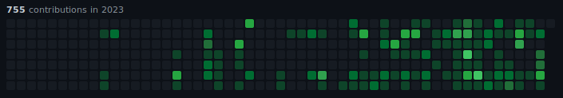</a><p><b>2023</b></p></td><td width="33%" align="center"><a href="https://github.com/AbdullahBakir97?tab=overview&from=2024-01-01&to=2024-12-31">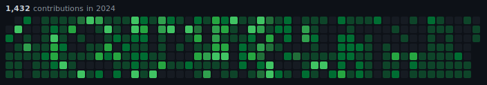</a><p><b>2024</b></p></td><td width="33%" align="center"><a href="https://github.com/AbdullahBakir97?tab=overview&from=2025-01-01&to=2025-12-31">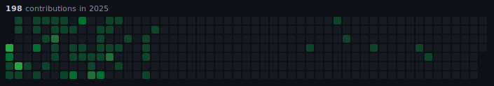</a><p><b>2025</b></p></td></tr></table>
<!-- SNAKE_GRID:END -->

<h3 align="center">🎨 3D Animated Profile</h3>

<table align="center" width="100%"><tr><td colspan="3" align="center"><p><b>2026 <sub>(live)</sub></b></p></td></tr><tr><td width="33%" align="center">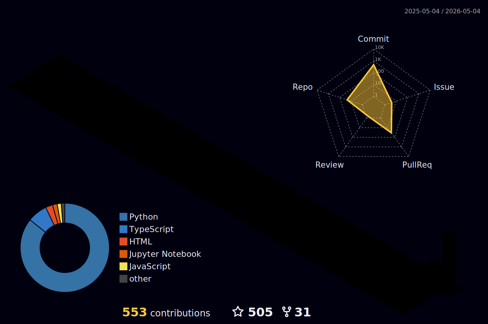<p><b>2023</b></p></td><td width="33%" align="center">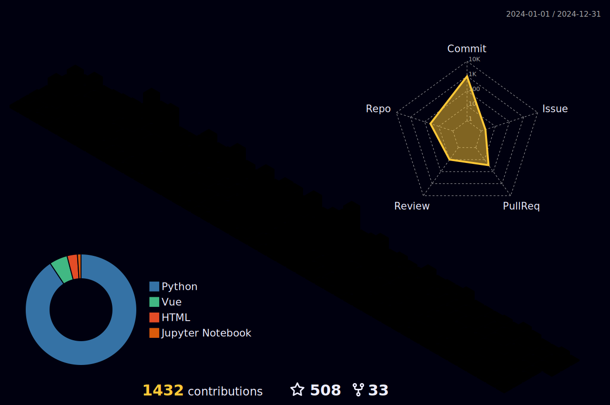<p><b>2024</b></p></td><td width="33%" align="center">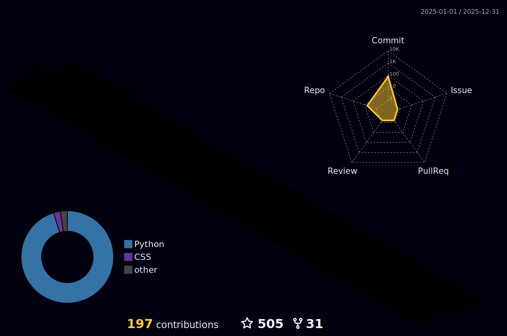<p><b>2025</b></p></td></tr></table>

<details>
<summary align="center"><b>More 3D styles</b> — alternate visualizations of the same rolling-window data</summary>

<br/>

<table align="center" width="100%"><tr><td width="25%" align="center"><p><b>Night View</b></p></td><td width="25%" align="center"><p><b>Git Block</b></p></td><td width="25%" align="center"><p><b>Season Animate</b></p></td><td width="25%" align="center"><p><b>South Season</b></p></td></tr></table>

</details>

<h3 align="center">🌆 GitHub Skylines</h3>

<!-- SKYLINE_GRID:START -->
<table align="center" width="100%"><tr><td colspan="3" align="center"><a href="https://github.com/AbdullahBakir97/AbdullahBakir97/blob/metrics-output/skyline-2026.stl"></a><p><b>2026 <sub>(live)</sub></b></p></td></tr><tr><td width="33%" align="center"><a href="https://github.com/AbdullahBakir97/AbdullahBakir97/blob/metrics-output/skyline-2023.stl"></a><p><b>2023</b></p></td><td width="33%" align="center"><a href="https://github.com/AbdullahBakir97/AbdullahBakir97/blob/metrics-output/skyline-2024.stl"></a><p><b>2024</b></p></td><td width="33%" align="center"><a href="https://github.com/AbdullahBakir97/AbdullahBakir97/blob/metrics-output/skyline-2025.stl"></a><p><b>2025</b></p></td></tr></table>
<!-- SKYLINE_GRID:END -->

<!-- STL_LINKS:START -->
<p align="center"><b>📐 Spin a 3D model:</b> <a href="https://github.com/AbdullahBakir97/AbdullahBakir97/blob/metrics-output/skyline-2023.stl">2023 STL</a> · <a href="https://github.com/AbdullahBakir97/AbdullahBakir97/blob/metrics-output/skyline-2024.stl">2024 STL</a> · <a href="https://github.com/AbdullahBakir97/AbdullahBakir97/blob/metrics-output/skyline-2025.stl">2025 STL</a> · <a href="https://github.com/AbdullahBakir97/AbdullahBakir97/blob/metrics-output/skyline-2026.stl">2026 STL <sub>(live)</sub></a></p>
<!-- STL_LINKS:END -->

<h3 align="center">🏙️ GitHub Cities</h3>

<!-- CITY_GRID:START -->
<table align="center" width="100%"><tr><td colspan="3" align="center"><a href="https://honzaap.github.io/GithubCity?name=AbdullahBakir97&year=2026"></a><p><b>2026 <sub>(live)</sub></b></p></td></tr><tr><td width="33%" align="center"><a href="https://honzaap.github.io/GithubCity?name=AbdullahBakir97&year=2023"></a><p><b>2023</b></p></td><td width="33%" align="center"><a href="https://honzaap.github.io/GithubCity?name=AbdullahBakir97&year=2024"></a><p><b>2024</b></p></td><td width="33%" align="center"><a href="https://honzaap.github.io/GithubCity?name=AbdullahBakir97&year=2025"></a><p><b>2025</b></p></td></tr></table>
<!-- CITY_GRID:END -->

<!-- GITCITY_LINKS:START -->
<p align="center"><b>🚗 Drive through:</b> <a href="https://honzaap.github.io/GithubCity?name=AbdullahBakir97&year=2023">2023 city</a> · <a href="https://honzaap.github.io/GithubCity?name=AbdullahBakir97&year=2024">2024 city</a> · <a href="https://honzaap.github.io/GithubCity?name=AbdullahBakir97&year=2025">2025 city</a> · <a href="https://honzaap.github.io/GithubCity?name=AbdullahBakir97&year=2026">2026 city <sub>(live)</sub></a></p>
<!-- GITCITY_LINKS:END -->

<p align="center"><em>⚠️ Regenerated daily. The current year refreshes with new contributions; past years are frozen archives. Click a Skyline tile to open its <code>.stl</code> in GitHub's built-in 3D viewer, or a City tile to drive through it at <a href="https://honzaap.github.io/GithubCity">honzaap.github.io/GithubCity</a>.</em></p>

<!-- CONNECT WITH ME -->
<div align="center">
  
  <a href="https://github.com/AbdullahBakir97">
    
  </a>
  
</div>

<h2 id="connect" align="center">🌍 Connect With Me</h2>

<p align="center">
  <a href="https://www.linkedin.com/in/abdullah-bakir-809065273/" aria-label="LinkedIn"></a>
  <a href="https://www.instagram.com/abdulahbaker/" aria-label="Instagram"></a>
  <a href="https://t.me/BlackSea0011" aria-label="Telegram"></a>
  <a href="https://github.com/AbdullahBakir97" aria-label="GitHub"></a>
</p>

<p align="center">
  📧 <a href="mailto:abdullah.bakir.1997@gmail.com">abdullah.bakir.1997@gmail.com</a>
</p>

<!-- 📝 GUESTBOOK — visitors leave a message via a pre-filled issue template -->
<div align="center">
  
</div>

<h2 id="guestbook" align="center">📝 Guestbook</h2>

<p align="center">
  Drop a hello, share something cool you're building, or just say hi! 👋<br/>
  Each entry opens a public issue on this repo (it's how the guestbook stays open and visible).
</p>

<p align="center">
  <a href="https://github.com/AbdullahBakir97/AbdullahBakir97/issues/new?template=guestbook.yml">
    
  </a>
  &nbsp;
  <a href="https://github.com/AbdullahBakir97/AbdullahBakir97/issues?q=label%3Aguestbook">
    
  </a>
</p>

<!-- SUPPORT -->
<div align="center">
  
  <a href="https://github.com/AbdullahBakir97">
    
  </a>
  
</div>

<h2 id="support" align="center">☕ Support My Work</h2>

<p align="center">If you find my projects helpful or want to support my work:</p>

<p align="center">
  <a href="https://www.buymeacoffee.com/abdullahbad"></a>
</p>

<p align="center"><em>Your support helps me create more open-source projects and tutorials!</em></p>

<!-- ============================================================ -->
<!-- 🎬 ANIMATED FOOTER BANNER — twinkling, mirrored gradient      -->
<!-- ============================================================ -->

<!-- snake animation as a visual handoff into the footer -->
<div align="center">

[⬆ back to top](#about)

</div>

<a href="#about">
  
</a>
